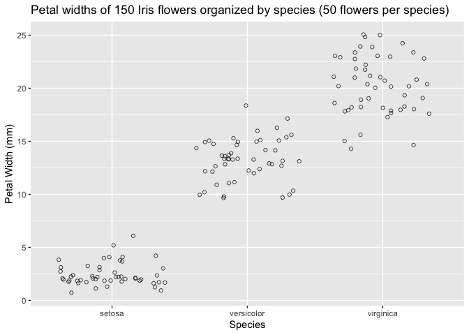
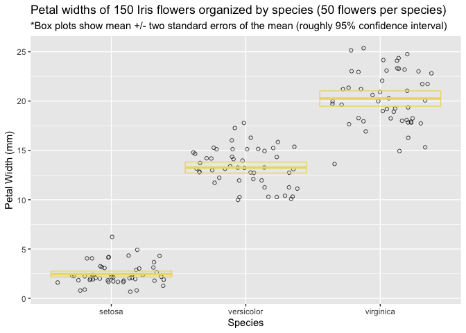
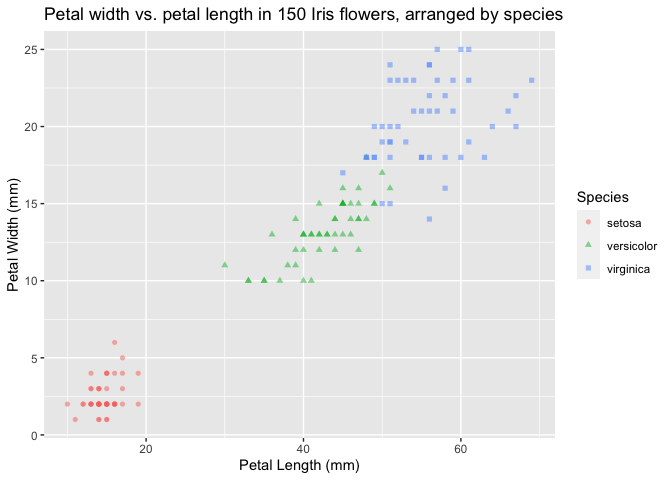

Lab 5
================
MaryJo Nelson
2021-02-23

Welcome to my Lab 5 report. In this report, I will rename and create new
variables, summarize data sets, and visualize the relationship between
variables using Edgar Anderson’s Iris Data, a data set with observations
of 150 Iris flowers of 3 different species.

## Load Packages and Read Data

``` r
library(tidyverse)
```

    ## ── Attaching packages ─────────────────────────────────────── tidyverse 1.3.0 ──

    ## ✓ ggplot2 3.3.2     ✓ purrr   0.3.4
    ## ✓ tibble  3.0.4     ✓ dplyr   1.0.2
    ## ✓ tidyr   1.1.2     ✓ stringr 1.4.0
    ## ✓ readr   1.4.0     ✓ forcats 0.5.0

    ## ── Conflicts ────────────────────────────────────────── tidyverse_conflicts() ──
    ## x dplyr::filter() masks stats::filter()
    ## x dplyr::lag()    masks stats::lag()

``` r
(iris <- as_tibble(iris))
```

    ## # A tibble: 150 x 5
    ##    Sepal.Length Sepal.Width Petal.Length Petal.Width Species
    ##           <dbl>       <dbl>        <dbl>       <dbl> <fct>  
    ##  1          5.1         3.5          1.4         0.2 setosa 
    ##  2          4.9         3            1.4         0.2 setosa 
    ##  3          4.7         3.2          1.3         0.2 setosa 
    ##  4          4.6         3.1          1.5         0.2 setosa 
    ##  5          5           3.6          1.4         0.2 setosa 
    ##  6          5.4         3.9          1.7         0.4 setosa 
    ##  7          4.6         3.4          1.4         0.3 setosa 
    ##  8          5           3.4          1.5         0.2 setosa 
    ##  9          4.4         2.9          1.4         0.2 setosa 
    ## 10          4.9         3.1          1.5         0.1 setosa 
    ## # … with 140 more rows

## Questions

> Question 1

Rename each variable so that it is all lower-case and uses an underscore
\_ instead of a period . in the name (the recommended coding style in
the tidyverse style guide). Print the resulting table.

``` r
(i2 <- rename(iris,
       sepal_length = Sepal.Length,
       sepal_width = Sepal.Width,
       petal_length = Petal.Length,
       petal_width = Petal.Width,
       species = Species))
```

    ## # A tibble: 150 x 5
    ##    sepal_length sepal_width petal_length petal_width species
    ##           <dbl>       <dbl>        <dbl>       <dbl> <fct>  
    ##  1          5.1         3.5          1.4         0.2 setosa 
    ##  2          4.9         3            1.4         0.2 setosa 
    ##  3          4.7         3.2          1.3         0.2 setosa 
    ##  4          4.6         3.1          1.5         0.2 setosa 
    ##  5          5           3.6          1.4         0.2 setosa 
    ##  6          5.4         3.9          1.7         0.4 setosa 
    ##  7          4.6         3.4          1.4         0.3 setosa 
    ##  8          5           3.4          1.5         0.2 setosa 
    ##  9          4.4         2.9          1.4         0.2 setosa 
    ## 10          4.9         3.1          1.5         0.1 setosa 
    ## # … with 140 more rows

> Question 2

Convert the four numerical variables from cm to mm by multiplying by 10.
Print the resulting table.

``` r
(i2_mm <- transmute(i2, 
       sepal_length_mm = sepal_length * 10,
       sepal_width_mm = sepal_width * 10,
       petal_length_mm = petal_length * 10,
       petal_width_mm = petal_width * 10,
       species = species))
```

    ## # A tibble: 150 x 5
    ##    sepal_length_mm sepal_width_mm petal_length_mm petal_width_mm species
    ##              <dbl>          <dbl>           <dbl>          <dbl> <fct>  
    ##  1              51             35              14              2 setosa 
    ##  2              49             30              14              2 setosa 
    ##  3              47             32              13              2 setosa 
    ##  4              46             31              15              2 setosa 
    ##  5              50             36              14              2 setosa 
    ##  6              54             39              17              4 setosa 
    ##  7              46             34              14              3 setosa 
    ##  8              50             34              15              2 setosa 
    ##  9              44             29              14              2 setosa 
    ## 10              49             31              15              1 setosa 
    ## # … with 140 more rows

> Question 3

Calculate sepal area and petal area (area is equal to length multiplied
by width). Print a table with only the variables sepal area, petal area,
and species.

``` r
(areas <- transmute(i2_mm,
                      sepal_area = sepal_length_mm * sepal_width_mm,
                      petal_area = petal_length_mm * petal_width_mm,
                    species = species))
```

    ## # A tibble: 150 x 3
    ##    sepal_area petal_area species
    ##         <dbl>      <dbl> <fct>  
    ##  1       1785         28 setosa 
    ##  2       1470         28 setosa 
    ##  3       1504         26 setosa 
    ##  4       1426         30 setosa 
    ##  5       1800         28 setosa 
    ##  6       2106         68 setosa 
    ##  7       1564         42 setosa 
    ##  8       1700         30 setosa 
    ##  9       1276         28 setosa 
    ## 10       1519         15 setosa 
    ## # … with 140 more rows

> Question 4

Calculate the following statistics for the entire dataset from the sepal
length variable and print the resulting table:

-   sample size

-   maximum value

-   minimum value

-   range

-   median

-   first quartile (q1)

-   third quartile (q2)

-   inter-quartile range (iqr)

``` r
(summary_sepal_length <- summarize(i2_mm,
          sample_size = n(),
          max_value = max(sepal_length_mm),
          min_value = min(sepal_length_mm),
          range = max_value - min_value,
          median = median(sepal_length_mm),
          first_quartile = quantile(sepal_length_mm, .25),   
          third_quartile = quantile(sepal_length_mm, .75),
          inter_quartile_range = IQR(sepal_length_mm)))
```

    ## # A tibble: 1 x 8
    ##   sample_size max_value min_value range median first_quartile third_quartile
    ##         <int>     <dbl>     <dbl> <dbl>  <dbl>          <dbl>          <dbl>
    ## 1         150        79        43    36     58             51             64
    ## # … with 1 more variable: inter_quartile_range <dbl>

> Question 5

Calculate the following statistics for each species from the petal width
variable and print the resulting table:

-   sample size

-   mean

-   standard deviation

-   variance

-   standard error of the mean

-   approximate 95% confidence interval

``` r
species_grouped <- group_by(i2_mm, species)

(summary_petal_width <- summarize(species_grouped,
                                  sample_size = n(),
                                  mean = mean(petal_width_mm),
                                  sd = sd(petal_width_mm),
                                  var = var(petal_width_mm),
                                  sem = sd / sqrt(sample_size),
                                  ci_upper = mean + 2*sem,   
                                  ci_lower = mean - 2*sem))
```

    ## `summarise()` ungrouping output (override with `.groups` argument)

    ## # A tibble: 3 x 8
    ##   species    sample_size  mean    sd   var   sem ci_upper ci_lower
    ##   <fct>            <int> <dbl> <dbl> <dbl> <dbl>    <dbl>    <dbl>
    ## 1 setosa              50  2.46  1.05  1.11 0.149     2.76     2.16
    ## 2 versicolor          50 13.3   1.98  3.91 0.280    13.8     12.7 
    ## 3 virginica           50 20.3   2.75  7.54 0.388    21.0     19.5

> Question 6

Visualize the relationship between petal width and species using a strip
plot.

``` r
ggplot(data = i2_mm) +
  geom_jitter(mapping = aes(y = petal_width_mm, x = species), shape = 1,
              alpha = .7) +
  labs(x = "Species", y = "Petal Width (mm)", title = "Petal widths of 150 Iris flowers organized by species (50 flowers per species)")
```

<!-- -->

> Question 7

Starting with the previous graph, add the mean and 95% confidence
interval for each species

``` r
ggplot(data = i2_mm) +
  geom_jitter(mapping = aes(y = petal_width_mm, x = species), shape = 1,
              alpha = .7) +
  geom_crossbar(data = summary_petal_width, mapping = aes(x = species, y = mean, 
                                                          ymax = ci_upper, ymin = ci_lower),
                color = "#EDDA74") +
  labs(x = "Species", y = "Petal Width (mm)", title = "Petal widths of 150 Iris flowers organized by species (50 flowers per species)",
       subtitle = "*Box plots show mean +/- two standard errors of the mean (roughly 95% confidence interval)")
```

<!-- -->

> Question 8

Visualize the relationship between petal length, petal width, and
species using a scatterplot. Map the two numerical variables to the x
and y axes and map species to the color and shape aesthetics.

``` r
ggplot(data = i2_mm) +
  geom_point(mapping = aes(x = petal_length_mm, y = petal_width_mm, color = species, shape = species),
               alpha = .5) +
  labs(x = "Petal Length (mm)", y = "Petal Width (mm)", color = "Species", shape = "Species", 
       title = "Petal width vs. petal length in 150 Iris flowers, arranged by species")
```

<!-- -->

## Session Info

``` r
sessioninfo::session_info()
```

    ## ─ Session info ───────────────────────────────────────────────────────────────
    ##  setting  value                       
    ##  version  R version 4.0.3 (2020-10-10)
    ##  os       macOS Catalina 10.15.7      
    ##  system   x86_64, darwin17.0          
    ##  ui       X11                         
    ##  language (EN)                        
    ##  collate  en_US.UTF-8                 
    ##  ctype    en_US.UTF-8                 
    ##  tz       America/Chicago             
    ##  date     2021-02-23                  
    ## 
    ## ─ Packages ───────────────────────────────────────────────────────────────────
    ##  package     * version date       lib source        
    ##  assertthat    0.2.1   2019-03-21 [1] CRAN (R 4.0.2)
    ##  backports     1.1.10  2020-09-15 [1] CRAN (R 4.0.2)
    ##  broom         0.7.2   2020-10-20 [1] CRAN (R 4.0.2)
    ##  cellranger    1.1.0   2016-07-27 [1] CRAN (R 4.0.2)
    ##  cli           2.1.0   2020-10-12 [1] CRAN (R 4.0.2)
    ##  colorspace    1.4-1   2019-03-18 [1] CRAN (R 4.0.2)
    ##  crayon        1.3.4   2017-09-16 [1] CRAN (R 4.0.2)
    ##  DBI           1.1.0   2019-12-15 [1] CRAN (R 4.0.2)
    ##  dbplyr        2.0.0   2020-11-03 [1] CRAN (R 4.0.3)
    ##  digest        0.6.27  2020-10-24 [1] CRAN (R 4.0.2)
    ##  dplyr       * 1.0.2   2020-08-18 [1] CRAN (R 4.0.2)
    ##  ellipsis      0.3.1   2020-05-15 [1] CRAN (R 4.0.2)
    ##  evaluate      0.14    2019-05-28 [1] CRAN (R 4.0.1)
    ##  fansi         0.4.1   2020-01-08 [1] CRAN (R 4.0.2)
    ##  farver        2.0.3   2020-01-16 [1] CRAN (R 4.0.2)
    ##  forcats     * 0.5.0   2020-03-01 [1] CRAN (R 4.0.2)
    ##  fs            1.5.0   2020-07-31 [1] CRAN (R 4.0.2)
    ##  generics      0.1.0   2020-10-31 [1] CRAN (R 4.0.2)
    ##  ggplot2     * 3.3.2   2020-06-19 [1] CRAN (R 4.0.2)
    ##  glue          1.4.2   2020-08-27 [1] CRAN (R 4.0.2)
    ##  gtable        0.3.0   2019-03-25 [1] CRAN (R 4.0.2)
    ##  haven         2.3.1   2020-06-01 [1] CRAN (R 4.0.2)
    ##  hms           0.5.3   2020-01-08 [1] CRAN (R 4.0.2)
    ##  htmltools     0.5.0   2020-06-16 [1] CRAN (R 4.0.2)
    ##  httr          1.4.2   2020-07-20 [1] CRAN (R 4.0.2)
    ##  jsonlite      1.7.1   2020-09-07 [1] CRAN (R 4.0.2)
    ##  knitr         1.30    2020-09-22 [1] CRAN (R 4.0.2)
    ##  labeling      0.4.2   2020-10-20 [1] CRAN (R 4.0.2)
    ##  lifecycle     0.2.0   2020-03-06 [1] CRAN (R 4.0.2)
    ##  lubridate     1.7.9   2020-06-08 [1] CRAN (R 4.0.2)
    ##  magrittr      1.5     2014-11-22 [1] CRAN (R 4.0.2)
    ##  modelr        0.1.8   2020-05-19 [1] CRAN (R 4.0.2)
    ##  munsell       0.5.0   2018-06-12 [1] CRAN (R 4.0.2)
    ##  pillar        1.4.6   2020-07-10 [1] CRAN (R 4.0.2)
    ##  pkgconfig     2.0.3   2019-09-22 [1] CRAN (R 4.0.2)
    ##  purrr       * 0.3.4   2020-04-17 [1] CRAN (R 4.0.2)
    ##  R6            2.5.0   2020-10-28 [1] CRAN (R 4.0.2)
    ##  Rcpp          1.0.5   2020-07-06 [1] CRAN (R 4.0.2)
    ##  readr       * 1.4.0   2020-10-05 [1] CRAN (R 4.0.2)
    ##  readxl        1.3.1   2019-03-13 [1] CRAN (R 4.0.2)
    ##  reprex        0.3.0   2019-05-16 [1] CRAN (R 4.0.2)
    ##  rlang         0.4.8   2020-10-08 [1] CRAN (R 4.0.2)
    ##  rmarkdown     2.5     2020-10-21 [1] CRAN (R 4.0.3)
    ##  rstudioapi    0.11    2020-02-07 [1] CRAN (R 4.0.2)
    ##  rvest         0.3.6   2020-07-25 [1] CRAN (R 4.0.2)
    ##  scales        1.1.1   2020-05-11 [1] CRAN (R 4.0.2)
    ##  sessioninfo   1.1.1   2018-11-05 [1] CRAN (R 4.0.2)
    ##  stringi       1.5.3   2020-09-09 [1] CRAN (R 4.0.2)
    ##  stringr     * 1.4.0   2019-02-10 [1] CRAN (R 4.0.2)
    ##  tibble      * 3.0.4   2020-10-12 [1] CRAN (R 4.0.2)
    ##  tidyr       * 1.1.2   2020-08-27 [1] CRAN (R 4.0.2)
    ##  tidyselect    1.1.0   2020-05-11 [1] CRAN (R 4.0.2)
    ##  tidyverse   * 1.3.0   2019-11-21 [1] CRAN (R 4.0.2)
    ##  utf8          1.1.4   2018-05-24 [1] CRAN (R 4.0.2)
    ##  vctrs         0.3.4   2020-08-29 [1] CRAN (R 4.0.2)
    ##  withr         2.3.0   2020-09-22 [1] CRAN (R 4.0.2)
    ##  xfun          0.19    2020-10-30 [1] CRAN (R 4.0.2)
    ##  xml2          1.3.2   2020-04-23 [1] CRAN (R 4.0.2)
    ##  yaml          2.2.1   2020-02-01 [1] CRAN (R 4.0.2)
    ## 
    ## [1] /Library/Frameworks/R.framework/Versions/4.0/Resources/library
